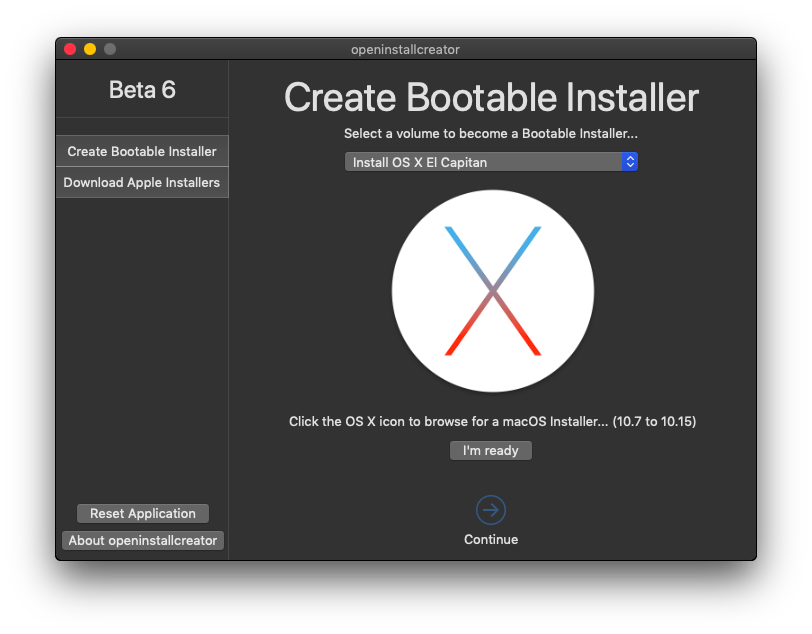
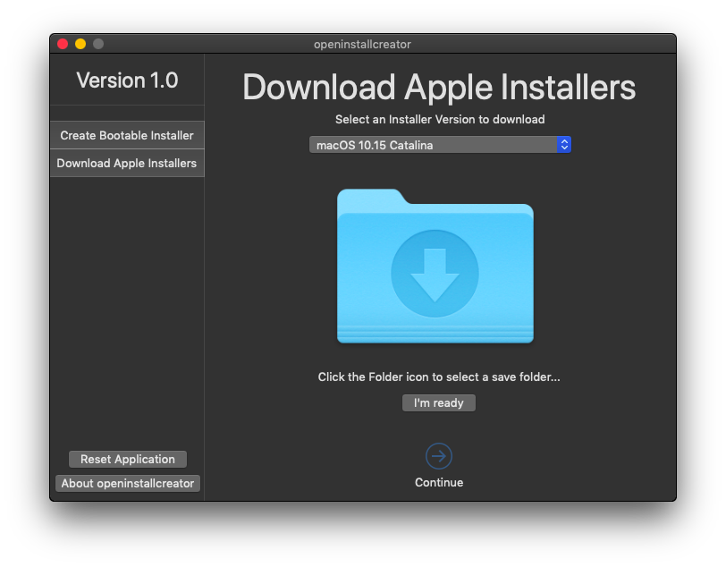

# [openinstallcreator beta](https://github.com/Minh-Ton/openinstallcreator)
An open-source AppleScriptObj-C application allows you to make a bootable macOS/OS X Installer... and download macOS.

## Requirements
- Minimum requirement: ***OS X 10.6 Snow Leopard and newer (requires OS X 10.7 or newer to download Installers).***
- Supported Installers: ***OS X 10.7 Lion to macOS 10.15 Catalina.***
- Installers Available for download: ***OS X 10.10 Yosemite to macOS 10.15 Catalina.*** (More Installer downloads below)
- Bootable USB/Disk size: ***At least 8GB for OS X 10.9 to macOS 10.14; 10GB for macOS 10.15 Catalina.***

## More Installer downloads

#### Although you cannot download OS X 10.7 - 10.9 Installers using the app, these are the link to download the original version of the Installer Apps.

  
Download OS X 10.7 - 10.9 Installers

  
  - [Download Install OS X 10.9 Mavericks.app]()
  
  - [Download Install OS X 10.8 Mountain Lion.app]()
  
  - [Download Install Mac OS X 10.7 Lion.app]()
  

#### For these 10.5 and 10.6 Installers, they are a disk image so you cannot use it to create a bootable installer with the app. However, you can restore to create a bootable installer using Disk Utility.

  
Download Mac OS X 10.5 - 10.6 Installers

  
  - [Download `MacOSX_SnowLeopard.dmg`](https://mega.nz/file/xrwVmTYa#jQ1jIle3mxHUKyZ0TZ-D2QeBRJ4y90FTOO0s79ghkuw)
  
  - [Download `MacOSX_Leopard.iso`](https://mega.nz/file/N6JnlIiZ#VCz-varFu5_xSyklFA7nUdwauWgS5GNlqdiNADz8YeM)
  

## Screenshots

  

## Limitations/Issues

  
View Limitations

- When the app is running in the background, it won't show the GUI when clicked onto the Dock Icon. A workaround for this is to **_secondary click_** the openinstallcreator Dock Icon, then choose **_"Show All Window"_**.

- While the app is doing some heavy tasks, such as `Create Bootable Installer` or `Download Apple Installer`, the *"spinning rainbow cursor"* will appeared when hovering the cursor on the application GUI. *(It's still doing it work though, just because there are so many tasks that's being added to the queue, making the queue banked up)*.

  
View Issues

  
 - As I'm using a vintage Mac, which only supports up to OS X 10.15 El Capitan so if there is any issue with 10.12 - 10.15 bootable installer creation, please let me know.
 
 - Due to the slow speed of downloading files from GitHub, I will push updates through Dropbox for a faster speed & reliability.

  
## Credits
- Thanks to [RMC Team](https://github.com/rmc-team)'s [macOS Downloader](https://github.com/rmc-team/macos-downloader), which I used to complete the `Download Apple Installers` feature.

## License
- This project is licensed under the GPL-3.0 License. View [LICENSE](https://github.com/Minh-Ton/openinstallcreator/blob/master/LICENSE) for more detail. 
